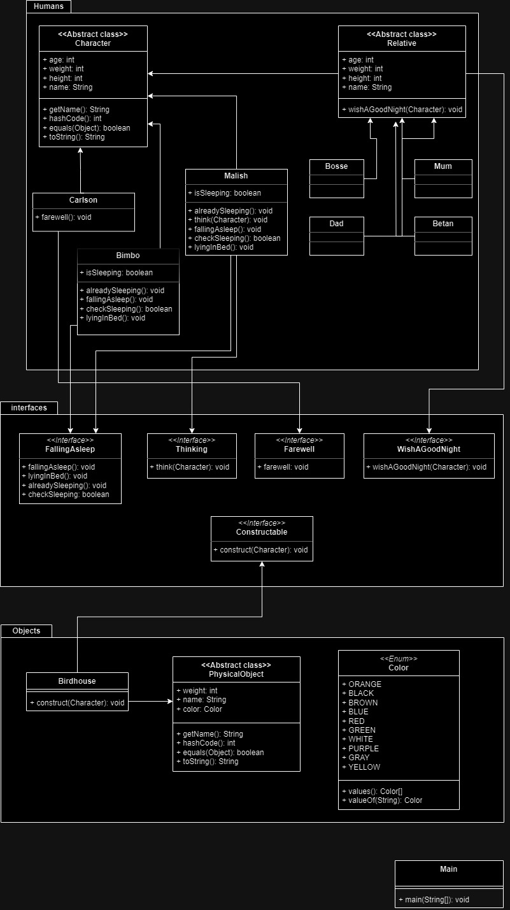

# Лабораторная работа №3
#### Описание предметной области, по которой должна быть построена объектная модель:

> Потом Карлсон стал прощаться: Час спустя Малыш уже лежал в своей кроватке, а рядом стояла корзинка,
где спал Бимбо. Все -- и мама, и папа, и Боссе, и Бетан -- пришли к нему в комнату пожелать спокойной ночи.
 Малыша уже одолевал сон. Но он еще не спал, а думал о Карлсоне. Что он сейчас делает, Карлсон?
Может, как раз что-нибудь мастерит... скворечник или еще что...

#### Программа должна удовлетворять следующим требованиям:
1. Доработанная модель должна соответствовать принципам SOLID.
2. Программа должна содержать как минимум два интерфейса и один абстрактный класс (номенклатура должна быть согласована с преподавателем).
3. В разработанных классах должны быть переопределены методы equals(), toString() и hashCode().
4. Программа должна содержать как минимум один перечисляемый тип (enum).

#### Порядок выполнения работы:
1. Доработать объектную модель приложения.
2. Перерисовать диаграмму классов в соответствии с внесёнными в модель изменениями.
3. Согласовать с преподавателем изменения, внесённые в модель.
4. Модифицировать программу в соответствии с внесёнными в модель изменениями

## Диаграмма классов реализованной объектной модели

